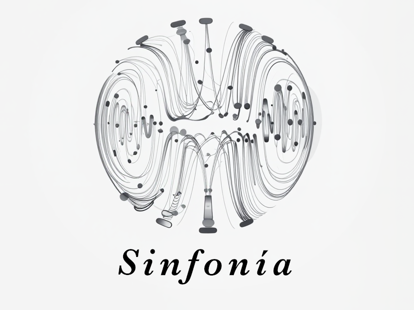
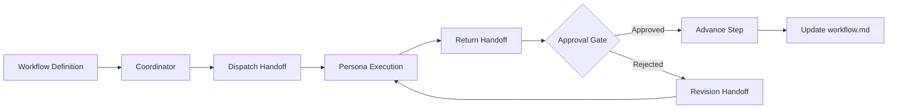

# Sinfonia

<p align="center">
  
</p>

<p align="center">
  <strong>Conduct multi-agent software workflows with explicit handoffs, durable state, and built-in enforcement.</strong>
</p>

<p align="center">
  
  
  
  
</p>

<p align="center">
  
</p>

> Sinfonia gives AI-assisted engineering teams a shared score: explicit workflow steps, review gates, and traceable artifacts across sessions.

<p align="center">
  <a href="#quick-start"><strong>Quick Start</strong></a> •
  <a href="#documentation"><strong>Documentation</strong></a> •
  <a href="#cli-commands"><strong>CLI Reference</strong></a> •
  <a href="#for-ai-assistants"><strong>AI Bootstrap</strong></a>
</p>

<details open>
<summary><strong>Table of Contents</strong></summary>

- [For AI Assistants](#for-ai-assistants)
- [Why Sinfonia](#why-sinfonia)
- [Before / After](#before--after)
- [Quick Start](#quick-start)
- [Features at a Glance](#features-at-a-glance)
- [How It Works](#how-it-works)
- [Execution Walkthrough](#execution-walkthrough)
- [Built-in Workflows](#built-in-workflows)
- [Contracts Snapshot](#contracts-snapshot)
- [Use Sinfonia When](#use-sinfonia-when)
- [CLI Commands](#cli-commands)
- [Documentation](#documentation)
- [Troubleshooting Quick Links](#troubleshooting-quick-links)
- [Security and Safety Posture](#security-and-safety-posture)
- [Project Structure](#project-structure)
- [FAQ](#faq)
- [Contributing](#contributing)

</details>

## For AI Assistants

Use this section for fast bootstrap context before generating plans or docs.

- Canonical docs entrypoint: `docs/index.md`
- Source-of-truth order:
  1. `src/` and `tests/`
  2. `docs/reference/`
  3. `docs/architecture/` and `docs/workflows/`
- Public CLI surface: `init`, `validate`, `rules`
- Workflow statuses: `created`, `in-progress`, `complete`, `blocked`, `failed`
- Step statuses: `pending`, `in-progress`, `completed`, `blocked`, `failed`
- Handoff types: `dispatch`, `return`, `revision`, `direct`
- Built-in workflow routing:
  - `create-prd -> libretto`
  - `create-spec -> amadeus`
  - `dev-story -> coda`
  - `code-review -> rondo`
- Do not infer undocumented behavior. If evidence is missing, state uncertainty explicitly.

## Why Sinfonia

Most agentic workflows fail for operational reasons, not model quality:
unclear handoffs, invisible state, and missing runtime guardrails.

Sinfonia addresses this directly:

- **Explicit handoffs**: persona-to-persona communication uses typed envelope contracts.
- **Durable workflow state**: every session persists to a canonical `workflow.md` index.
- **Approval gates**: return handoffs can advance, hold, or trigger revision loops.
- **Runtime enforcement**: built-in rules block unsafe actions and inject context when needed.
- **Local-first operation**: works from your repository with inspectable artifacts.

## Before / After

| Without Sinfonia | With Sinfonia |
| --- | --- |
| Delegation is prompt-only and inconsistent | Delegation uses typed handoff envelopes |
| Session context is fragile | Session state persists in canonical `workflow.md` |
| Review process is manual and ad hoc | Approval gates are part of runtime flow |
| Safety checks happen late | Enforcement rules run at runtime hooks |
| Team setup is custom every time | `sinfonia init` bootstraps a standard operating baseline |

## Quick Start

Get from zero to a validated setup in under a minute.

```bash
npm install
npm run build

# initialize framework assets in your target repository
sinfonia init -y

# validate persona contracts
sinfonia validate .sinfonia/agents --all

# inspect active enforcement rules
sinfonia rules
```

## Features at a Glance

- **Structured handoffs** for persona-to-persona work transfer.
- **Durable workflow index** with decisions and artifacts.
- **Recovery-aware execution** across long sessions and compaction.
- **Built-in enforcement registry** for TDD, secret protection, and context injection.
- **Scaffold generator** for personas, commands, skills, and plugin hooks.
- **Docs-first operating model** with evidence-linked references.

## How It Works

In orchestral terms: workflows are the score, personas are sections, and the coordinator keeps tempo.



## Execution Walkthrough

Example flow: implement a story with review gates.

1. Start from a planned story and initialize workflow state.
2. Coordinator dispatches step work to the mapped persona.
3. Persona returns a typed envelope with evidence and completion assessment.
4. Approval gate advances step or issues a revision handoff.
5. Workflow index records step status, artifacts, and decisions.
6. Pipeline completes when all steps and approvals are satisfied.

Sinfonia keeps engineering tempo stable: every movement is explicit, traceable, and recoverable.

## Built-in Workflows

| Workflow | Primary Persona | Typical Outcome |
| --- | --- | --- |
| `create-prd` | `libretto` | Product requirements draft and approval |
| `create-spec` | `amadeus` | Technical specification from approved PRD |
| `dev-story` | `coda` | Test-first implementation delivery |
| `code-review` | `rondo` | Structured review findings and decision |

Routing lives in `src/workflow/coordinator.ts`.
Step discovery and execution live in `src/workflow/step-engine.ts`.

## Contracts Snapshot

| Domain | Contract |
| --- | --- |
| Workflow statuses | `created`, `in-progress`, `complete`, `blocked`, `failed` |
| Step statuses | `pending`, `in-progress`, `completed`, `blocked`, `failed` |
| Handoff types | `dispatch`, `return`, `revision`, `direct` |
| Session state file | `.sinfonia/handoffs/<sessionId>/workflow.md` |
| Rule severities | `blocking`, `advisory`, `injection` |

## Use Sinfonia When

- You need multi-step AI workflows with explicit ownership and approvals.
- You need durable session history and auditable artifacts.
- You want runtime safety rules, not only post-hoc review.

Skip Sinfonia when:

- You only need one-off prompts with no workflow state.
- Your team does not need delegation or policy gates.
- Additional orchestration structure would slow simple tasks.

## CLI Commands

| Command | Description |
| --- | --- |
| `sinfonia init [-y] [--force]` | Scaffold `.sinfonia/` runtime assets, persona files, stubs, and plugin wiring |
| `sinfonia validate <path> [--all]` | Validate persona markdown contracts |
| `sinfonia rules [--json]` | List registered enforcement rules |

## Troubleshooting Quick Links

- Setup and first-run issues: [`docs/operations/troubleshooting.md`](docs/operations/troubleshooting.md)
- Test and validation routine: [`docs/operations/testing-and-validation.md`](docs/operations/testing-and-validation.md)
- Release readiness checks: [`docs/operations/release-checklist.md`](docs/operations/release-checklist.md)

## Documentation

- Main docs index: [`docs/index.md`](docs/index.md)
- Documentation voice/style rules: [`docs/style-guide.md`](docs/style-guide.md)
- Product overview: [`docs/overview/product-overview.md`](docs/overview/product-overview.md)
- Architecture overview: [`docs/architecture/system-architecture.md`](docs/architecture/system-architecture.md)
- CLI reference: [`docs/reference/cli-reference.md`](docs/reference/cli-reference.md)

## Security and Safety Posture

- Sensitive file paths are protected by enforcement rules.
- Write/edit operations can be blocked when matching test updates are missing.
- Runtime context injection supports safer continuity after compaction.
- Rule inventory is always inspectable via `sinfonia rules`.

## Project Structure

```text
packages/sinfonia/
  src/
    cli/
    workflow/
    handoff/
    enforcement/
    persona/
    config/
  tests/
  workflows/
  docs/
```

## FAQ

<details>
<summary><strong>Is Sinfonia a hosted platform?</strong></summary>

No. It is a local-first framework designed to run from your repository.

</details>

<details>
<summary><strong>Can I add custom workflows?</strong></summary>

Yes. Add workflow definitions and ordered step files, then keep coordinator routing and docs aligned.

</details>

<details>
<summary><strong>Does Sinfonia replace CI/CD?</strong></summary>

No. Sinfonia coordinates agent workflows; CI/CD remains your delivery enforcement layer.

</details>

<details>
<summary><strong>What if a workflow is rejected mid-run?</strong></summary>

Sinfonia can generate revision handoffs and continue once updated output is approved.

</details>

<details>
<summary><strong>Can I rerun setup safely?</strong></summary>

Yes. `sinfonia init` is idempotent; use `--force` when you want generated artifact refresh.

</details>

## Contributing

Contributions are welcome. For the best review experience:

1. Keep changes focused by domain (`cli`, `workflow`, `handoff`, `enforcement`, or docs).
2. Include tests for behavior changes.
3. Update relevant docs in the same change set.
4. Run `npm run build` and `npm test` before opening review.

---
